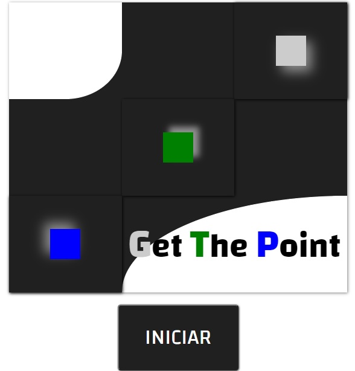

# GET THE POINT :star_struck:

## FUNCIONALIDADE

- [x] Multiplayer
- [x] Contador de pontos
- [x] Inicio de jogo sincronizado
- [x] Stop do jogo caso os jogadores se desconectem
- [x] Possibilidade do player escolher a pontuação para ganhar
- [ ] Criação de Salas privadas
- [ ] Alteração do nome do Player

## O QUE FOI USADO

- Javascript :star_struck:
- Html5
- Css
- SocketIO
- NodeJS

## SOBRE O GAME

Este é um pequeno jogo experimental com HTML/Javascript. O jogo tem por objeto recolher os pontos que aparecem aleatóriamente de tempos em tempos, dependendo da cor do elemento que aparceu para ser recolhido temos uma pontuação diferente.

- ELEMENTO VERDE   : 2 Ponto
- ELEMENTO LARANJA : 5 Pontos

O jogador que conseguir recolher 50 pontos é o vencedor.

## CONCEITOS APRENDIDOS DURANTE DESENVOLVIMENTO

Muita coisa foi aprendida durante o desenvolvimento dessa pequena "Brincadeira" como:

### **PADRÕES DE PROJETO**

**Observer Pattern**

Um padrão revolucionario utilizado no desenvolvimento do game foi o **OBSERVER** que consiste em uma entidade **SUBJECT (Sujeito)** que tem a capacidade de emitir eventos quando algo alterar seus parametros enquanto, outras entidades ficam a observar (**OBSERVERS**) as alterações desse subject, quando alguma informação interessante ao observer foi emitida pelo subject ela é recebida e tratada da forma que o observer quiser. Isso foi muito util para auxiliar na propagação de alguns eventos internos do jogo e como auxilio ao SocketIo que foi outra tecnologia aprendida durante o desenvolvimento.

**Factory Pattern**

Um padrão muito conhecido no mundo do desenvolvimento. Muitas implementações do jogo tem processos complexos de serem montados como por exemplo a função _Game_ que contém toda a lógica do joguinho. Com a ajuda do Factory Pattern nos podemos delegar as montagens desses processos complexos em um metodo e com isso podemos criar uma instancia do _Game_ em qualquer lugar de forma simples apenas invocando o metodo de fabricação. Com isso ganhamos uma modularidade no projeto e um desacoplamento (ja que a montagem e complexidade estão encapsuladas).

## **TECNOLOGIA APRENDIDA**

**SocketIO**

Uma tecnologia utilizada por muitas empresas para criar funcionalidade **Real Time**. Ele funciona teoricamente como padrão observer mas com a possibilidade de notificações **bidirecionais** (_O padrão observer também possibilita isso_). Você emit uma notificação passando qualquer tipo de informação enquanto do outro lado existe outra conexão que fica **ouvindo** um certo tipo de evento, quando é emitido o evento esperado por 1 ou mais ouvintes eles recebem os dados enviado pelo emissor do evento e trata cada um da forma que desejar.

# INSPIRAÇÃO

Este projeto foi inspirado no projeto do youtuber @filipedeschamps.

Siga o canal dele -> [Filipe Deschamps - YouTube](https://www.youtube.com/channel/UCU5JicSrEM5A63jkJ2QvGYw)

Ele fornece excelente conteudo para desenvolvedores (experientes ou não), vale a penda dar uma conferida.
